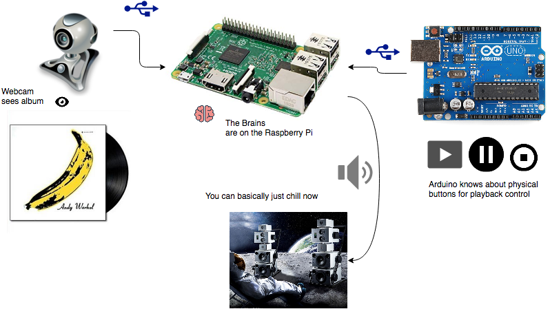
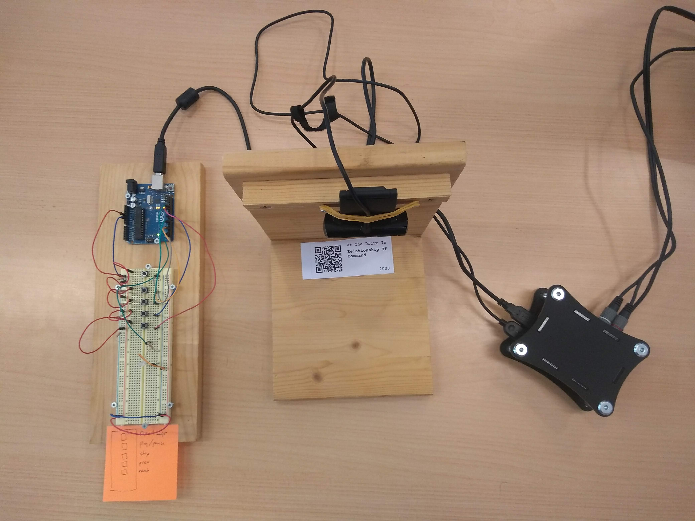

# retroversion

Play music on Spotify by scanning and album cover with your webcam.

## Background

This project started as a personal pet project. It has been adopted by the [if coding](https://www.ifcoding.nl/) community as one of their hobby projects, and is currently actively being worked on.

### What does it do?

When you place an album (cd, vinyl) cover in front (or underneath) the webcam, and press "scan", this program will take a photo, offer it to Google Vision API, and guestimate the corresponding Spotify URI, and tell Spotify to start playback.

Don't have the physical album? No worries! Print a QR code representing the album, and you're good to go.

### Why?

There is a certain appeal to a physical music collection. Browsing through your personal collection, picking up the record that feels _just right_ for the moment. Placing it on the record player, or shoving it in the cd player. Press play, sit back. Let the music roll over your.

How different with screens and Spotify. Sure, the collection is huge, and a recommender engine is also nice, but it misses the ritual of old.

This project aims to provide the middle ground between the two.

## Introduction

The current setup features a webcam, a Raspberry Pi and an Arduino.

Photorealistic rendering:

## Code

You can use this repository to host all new code and other related artifacts.

There are also two other repositories, where code is hosted that is already written.

* [arduino-music-control](https://github.com/tssmits/arduino-music-control): Hackish-but-working. Features Python code that reads the Arduino, controls the webcam (via fswebcam command), and Spotify code.
* [qrgen](https://github.com/tssmits/qrgen): Want to make you own QR-code-album-labels? Now you can! Printer-ready.
